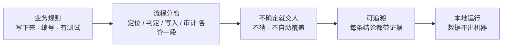

# Hi, I'm SYY 👋

**金融业务流程 × 软件工程 × 自动化产品落地**

我做债券承销与合规核查相关的业务工作，也把这些工作里重复、易错、难追溯的环节做成能真正落地的本地工具。
下面五个项目是同一条主线的不同切面：**理解业务规则 → 抽成可复核的软件流程 → 交付能双击运行的产品**。

> Bond-market workflow automation. Every project below takes a repetitive,
> error-prone step in bond underwriting or compliance work and turns it into an
> auditable local tool — with the business rules written down and tested, not
> buried in someone's head.

---

## 项目

<table>
<tr>
<td width="72"></td>
<td><a href="https://github.com/Simple-StayHungry/document-review-workbench"><b>Document Review Workbench</b></a> 债券业务核查分析文件自动化工作台 自研 OOXML 处理层 · 能自动判定的直接生成修订，判不了的进人工队列，未确认零写入</td>
</tr>
<tr>
<td width="72"></td>
<td><a href="https://github.com/Simple-StayHungry/document-update-workbench"><b>Document Update Workbench</b></a> 债券发行说明性文件批量更新工作台 一份募集说明书落到一批文件 · ZIP 进 / ZIP 出 · 主标题与盖章页冻结不可改写</td>
</tr>
<tr>
<td width="72"></td>
<td><a href="https://github.com/Simple-StayHungry/bond-weekly-automation"><b>Bond Weekly Automation</b></a> 债券市场周报自动化生成 四源官方抓取 · 逐省逐页与官方总数对账 · 数据不可信时判定 BLOCKED，不出报告</td>
</tr>
<tr>
<td width="72"></td>
<td><a href="https://github.com/Simple-StayHungry/duecheck"><b>DueCheck</b></a> 网页核查截图「主体 · 时间 · 结果」自动化质检 四层可归因流水线 · 五态判定而非布尔 · 定位与识别过程拿不到目标答案</td>
</tr>
<tr>
<td width="72"></td>
<td><a href="https://github.com/Simple-StayHungry/electronic-date-stamp"><b>Electronic Date Stamp</b></a> PDF 落款日期自动化写入与审计 只追加写入 · 不覆盖任何原有内容 · 独立审计层回读像素</td>
</tr>
</table>

---

## 这几件事的共同点

不是"用 AI 大干一场"，而是把每一步的**边界**写清楚：什么能自动、什么必须人工确认、
什么情况下宁可不出结果。金融业务的自动化，可信度比覆盖率重要。

## 技术

`Python` · `OOXML / DOCX·XLSX 底层处理` · `PDF` · `FastAPI` · `OpenCV` · `SQLite` · `pytest`
`原生 JS 前端（无框架、无构建步骤）` · `macOS / Windows / Linux`

多数项目的运行时不依赖重型框架，甚至**零第三方依赖** —— 目标是券商内网、离线机器上双击就能跑。
