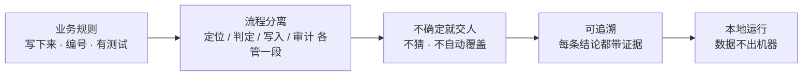

# Hi, I'm SYY 👋

**金融业务流程 × 软件工程 × 自动化产品落地**

我做债券承销与合规核查相关的业务工作，也把这些工作里重复、易错、难追溯的环节做成能真正落地的本地工具。
下面五个项目是同一条主线的不同切面：**理解业务规则 → 抽成可复核的软件流程 → 交付能双击运行的产品**。

> Bond-market workflow automation. Every project below takes a repetitive,
> error-prone step in bond underwriting or compliance work and turns it into an
> auditable local tool — with the business rules written down and tested, not
> buried in someone's head.

---

## 项目

### 📄 [Document Review Workbench](https://github.com/Simple-StayHungry/document-review-workbench)
**债券业务核查分析文件自动化工作台**
把募集说明书、核查意见及分析文件的比对、定位、更新和修订做成可复核流水线。
自研 OOXML 处理层，零运行时依赖；能自动判定的直接生成修订，判不了的进人工队列，**未确认零写入**。

### 📝 [Document Update Workbench](https://github.com/Simple-StayHungry/document-update-workbench)
**债券发行说明性文件批量更新工作台**
一份募集说明书要落到一批说明性文件上。ZIP 进 / ZIP 出批量处理，Web 与命令行同一内核；
保护主标题与盖章页不被改写，只把真正需要人决定的事项推到复核界面。

### 📊 [Bond Weekly Automation](https://github.com/Simple-StayHungry/bond-weekly-automation)
**债券市场周报自动化生成**
交易商协会、上交所、深交所、北交所四源官方抓取，**逐省逐页与官方总数对账**；
完整批次固化为可回放快照；直接改写上周 Excel 成品的 OOXML 并强制校验历史区域未被触碰。
数据不可信时判定 `BLOCKED`，**不出报告**。

### 🌐 [DueCheck](https://github.com/Simple-StayHungry/duecheck)
**网页核查截图「主体 · 时间 · 结果」自动化质检**
四层可归因流水线：屏幕分解 → 页面映射 → 证据提取 → 规则判定。
每条判定都带证据，五态而非布尔；定位与识别过程**拿不到**目标公司名与历史结论。

### 📑 [Electronic Date Stamp](https://github.com/Simple-StayHungry/electronic-date-stamp)
**PDF 落款日期自动化写入与审计**
证据驱动、只追加：自动写入仅限阿拉伯数字，不覆盖任何原有内容；
写入后由**独立审计层**回读像素，允许区域外有半点改动即判定失败、不产出文件。

---

## 这几件事的共同点

不是"用 AI 大干一场"，而是把每一步的**边界**写清楚：什么能自动、什么必须人工确认、
什么情况下宁可不出结果。金融业务的自动化，可信度比覆盖率重要。

## 技术

`Python` · `OOXML / DOCX·XLSX 底层处理` · `PDF` · `FastAPI` · `OpenCV` · `SQLite` · `pytest`
`原生 JS 前端（无框架、无构建步骤）` · `macOS / Windows / Linux`

多数项目的运行时不依赖重型框架，甚至**零第三方依赖** —— 目标是券商内网、离线机器上双击就能跑。
